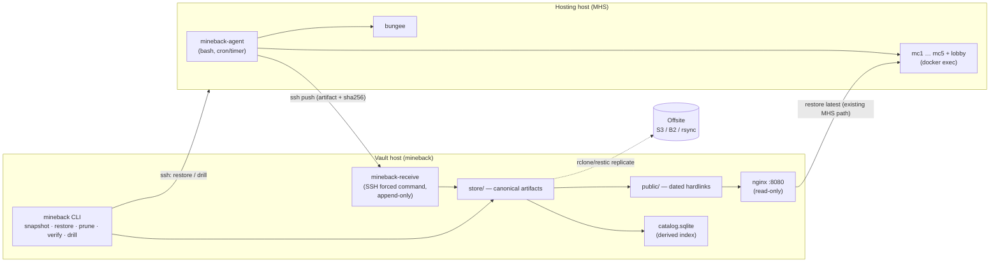
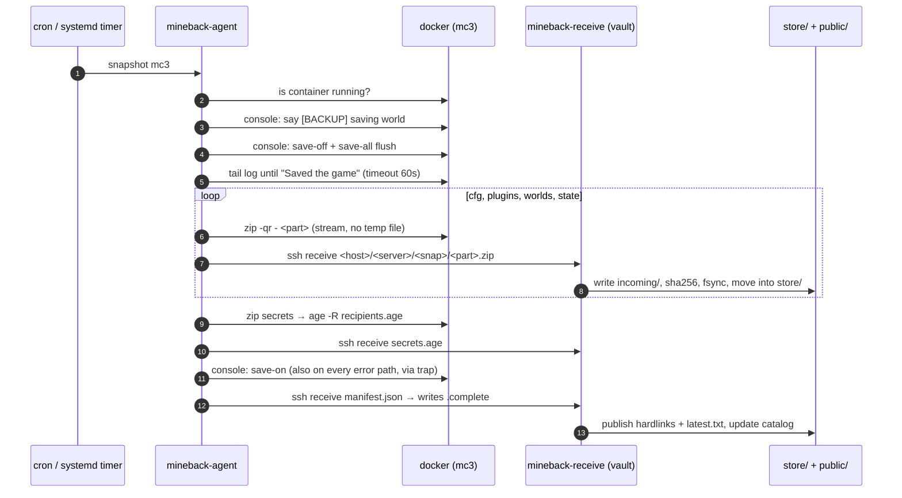

# mineback — Architecture

Backup and restore infrastructure for the Minecraft server farms deployed with
[minecraftHostingServer](https://github.com/cndrbrbr/minecraftHostingServer) (MHS).

> **Status:** design document. It describes the target system; the implementation
> lands in stages (see [FEATURES.md](FEATURES.md) for the milestone split).

---

## Contents

- [1. Goals and non-goals](#1-goals-and-non-goals)
- [2. What we are backing up](#2-what-we-are-backing-up)
- [3. Components](#3-components)
- [4. Topology and trust model](#4-topology-and-trust-model)
- [5. Data model](#5-data-model)
- [6. On-disk layout](#6-on-disk-layout)
- [7. Backup flow](#7-backup-flow)
- [8. Consistency model](#8-consistency-model)
- [9. Restore flows](#9-restore-flows)
- [10. Retention, dedupe, offsite](#10-retention-dedupe-offsite)
- [11. Integrity and verification](#11-integrity-and-verification)
- [12. Security](#12-security)
- [13. Observability](#13-observability)
- [14. Failure modes](#14-failure-modes)
- [15. Design decisions](#15-design-decisions)
- [16. Glossary](#16-glossary)

---

## 1. Goals and non-goals

### Goals

| # | Goal |
|---|------|
| G1 | Snapshot a **single** Minecraft server — world(s), plugins, config, player state — as versioned zip artifacts. |
| G2 | Snapshot a **whole hosting host** — every server on it plus the stack's own config (`docker-compose.yml`, `.env`, `keys/`). |
| G3 | Restore a **single server** from any retained snapshot, in place or onto a different host/slot (clone). |
| G4 | Restore a **whole hosting host** onto fresh hardware from nothing but the vault plus the MHS git repo. |
| G5 | Back up while servers keep running — no scheduled downtime for the nightly job. |
| G6 | Keep the existing self-service `restore latest` path working for students, byte-for-byte compatible. |
| G7 | Be operable by one admin under workshop time pressure: one command per job, obvious output, safe defaults. |

### Non-goals

- Continuous / point-in-time replication. Granularity is a snapshot, not a transaction.
- Backing up artifacts that MHS rebuilds deterministically (Spigot JARs, BuildTools output, the `script4kids` plugin build).
- Live migration of players between hosts. Restore implies a server restart.
- Multi-tenant access control. One admin, one vault, SSH keys as the only identity.

---

## 2. What we are backing up

The MHS Spigot container keeps everything on one volume mounted at `/server`.
Spigot is started with `--world-dir ./data/worlds`, `--plugins ./data/plugins`
and `--config ./data/cfg/server.properties`, but a number of files Spigot insists
on writing to its working directory stay in `/server` itself — and those are exactly
the ones the current `backup.sh` does not capture.

```
/server/                                 ← volume root
├── data/
│   ├── cfg/          server.properties, spigot.yml, bukkit.yml, commands.yml   → cfg.zip
│   ├── plugins/      plugin JARs + per-plugin config/data dirs                 → plugins.zip
│   └── worlds/       <level-name>, <level-name>_nether, <level-name>_the_end   → worlds.zip
├── whitelist.json  ops.json  banned-players.json  banned-ips.json              → state.zip
├── usercache.json  permissions.yml  help.yml                                   → state.zip
├── .version                            pinned Spigot version                   → state.zip
├── ssh_host_ed25519_key(.pub)          container SSH identity                  → secrets.age
├── ssh_host_rsa_key(.pub)                                                       → secrets.age
├── spigot-<version>.jar                rebuildable by BuildTools               ✗ excluded
├── bundler/  logs/  crash-reports/     runtime scratch                         ✗ excluded
└── .stopped  .shutdown                 transient control flags                 ✗ excluded
```

Two consequences worth stating explicitly, because they are the reason mineback
exists rather than "just keep using `backup.sh`":

1. **`state.zip` closes a real data-loss gap.** Whitelist, ops and the pinned
   Spigot version live outside `data/`. Restoring only `cfg`/`plugins`/`worlds`
   onto a fresh volume silently drops every whitelisted player and reverts the
   server to the image's default Spigot version.
2. **`secrets.age` keeps student tooling working after a host rebuild.** The
   container's SSH host keys live on the volume precisely so fingerprints stay
   stable. Restore them and FileZilla/PuTTY reconnect silently; lose them and
   every student hits a host-key-changed warning mid-workshop.

### Host level (fleet snapshot)

```
<mhs-repo>/
├── docker-compose.yml  docker-compose.bungeecord.yml  docker-compose.standalone.yml → hostconf.zip
├── spigot/  bungee/     local modifications to config/scripts                       → hostconf.zip
├── crontab fragment, iptables DOCKER-USER rules (captured as text)                  → hostconf.zip
├── .env                 MC*_SFTP_PUBKEY / MC*_CTRL_PUBKEY                           → hostconf-secrets.age
└── keys/mcN/*           student key pairs, incl. private keys                       → hostconf-secrets.age
```

Plus the `bungee_data` volume, captured as a server of kind `proxy`
(`config.yml`, `plugins/`, modules) — no worlds, no `cfg`.

### Classification rule

Every path lands in exactly one of three classes, and the class decides the
treatment:

| Class | Examples | Treatment |
|-------|----------|-----------|
| **Game data** | worlds, plugins, cfg, player state | zipped, stored in the clear, servable to containers for self-service restore |
| **Secrets** | SSH host keys, `.env`, `keys/` | zipped then encrypted with `age` to the vault recipient; never served over HTTP |
| **Regenerable** | Spigot JARs, bundler, logs, crash reports | excluded; reconstructed by the MHS entrypoint on first start |

---

## 3. Components



| Component | Runs on | Language | Job |
|-----------|---------|----------|-----|
| `mineback-agent` | every hosting host | bash | quiesce a server, pack artifacts, stream them to the vault, report result |
| `mineback-receive` | vault | bash | SSH forced command; validates names, verifies checksum, writes append-only |
| `mineback` CLI | vault | Python 3 (stdlib only) | catalog, restore orchestration, retention, verify, drill, metrics |
| `mineback-serve` | vault | nginx (compose) | serves `public/` read-only for the in-container `restore` command |

**Why this language split.** The agent runs on production workshop hosts: it must
depend on nothing beyond what the MHS host already has (`bash`, `docker`,
`ssh`, `zip`, `curl`) so enrolling a host never means installing a runtime next
to a live server. The vault does the thinking — manifests, catalog queries,
retention arithmetic, multi-step restore — which is miserable in bash, so it is
Python 3 with **no third-party dependencies** (`tomllib`, `sqlite3`, `hashlib`,
`json`, `subprocess` cover all of it).

---

## 4. Topology and trust model

**Push, not pull.** The agent initiates every transfer; the vault never opens a
connection into a hosting host to take a backup.

Why:

- Workshop hosts sit behind NAT and changing firewalls. Outbound SSH is the one
  thing that reliably works.
- A pull design needs vault-held credentials with `docker exec` rights on every
  production host. A compromised vault would then own every Minecraft server.
  Push inverts that: the host holds a key that can only *append* backups.
- Adding a host is one key and one cron line, with no vault-side network config.

**Append-only in both directions.** The agent's key is restricted with
`command="mineback-receive …",no-pty,no-port-forwarding,no-agent-forwarding`.
`mineback-receive` accepts exactly one verb — receive this artifact for this
host/server/snapshot — and refuses to overwrite an existing artifact. There is no
delete verb. A compromised hosting host can write junk *new* snapshots; it cannot
corrupt or erase yesterday's. Pruning happens only on the vault.

**Restore is the privileged direction.** Restores are driven by the admin from the
vault over their own SSH key (the `mc-ctrl` key MHS already issues, or root),
never by the agent's key. Backup credentials can never trigger a restore, which
is the destructive operation.

**Pull mode** exists as an opt-in for hosts that cannot run a timer (`mineback
snapshot --via ssh <host>`) and uses the admin key. It is the exception, not the
default.

---

## 5. Data model

Three entities. The filesystem is the source of truth; `catalog.sqlite` is a
derived cache that `mineback vault reindex` can rebuild from the manifests at
any time.

**Host** — one MHS deployment. Identified by a short stable `host-id`
(`kag-workshop-01`), not a hostname or IP, so a rebuilt machine keeps its history.

**Server snapshot** — one server at one instant.
Id: `<host-id>/<server>/<UTC timestamp>`, e.g. `kag-workshop-01/mc3/20260919T020314Z`.

```json
{
  "schema": 1,
  "snapshot_id": "20260919T020314Z",
  "host_id": "kag-workshop-01",
  "server": "mc3",
  "kind": "spigot",
  "reason": "scheduled",
  "started_at": "2026-09-19T02:03:14Z",
  "finished_at": "2026-09-19T02:04:01Z",
  "status": "complete",
  "quiesce": { "method": "hot", "save_flush_confirmed": true, "players_online": 0 },
  "source": {
    "spigot_version": "1.21.11",
    "level_name": "world",
    "worlds": ["world", "world_nether", "world_the_end"],
    "image_digest": "sha256:…",
    "agent_version": "0.3.0"
  },
  "artifacts": {
    "cfg.zip":     { "bytes": 18234,      "sha256": "…", "entries": 4 },
    "plugins.zip": { "bytes": 4823901,    "sha256": "…", "entries": 37 },
    "worlds.zip":  { "bytes": 214553600,  "sha256": "…", "entries": 1902 },
    "state.zip":   { "bytes": 2311,       "sha256": "…", "entries": 8 },
    "secrets.age": { "bytes": 1802,       "sha256": "…", "encrypted": true }
  }
}
```

**Fleet snapshot** — one host at one instant. It stores only host-level config and
*references* the server snapshots from the same run, so a fleet snapshot costs a
few kilobytes on top of the server snapshots and any single server can still be
restored out of it.

```json
{
  "schema": 1,
  "snapshot_id": "20260919T020000Z",
  "host_id": "kag-workshop-01",
  "mode": "bungeecord",
  "mhs_commit": "a1b2c3d",
  "status": "partial",
  "artifacts": {
    "hostconf.zip":         { "bytes": 41233, "sha256": "…" },
    "hostconf-secrets.age": { "bytes": 9214,  "sha256": "…", "encrypted": true }
  },
  "servers": {
    "bungee": "20260919T020012Z",
    "lobby":  "20260919T020058Z",
    "mc1":    "20260919T020140Z",
    "mc2":    "20260919T020233Z",
    "mc3":    "20260919T020314Z",
    "mc4":    "20260919T020402Z",
    "mc5":    { "snapshot": null, "error": "container not running" }
  }
}
```

`status` is `complete`, `partial` (some servers failed or were down) or `failed`.
A `partial` fleet snapshot is kept and restorable — a host where one student's
container was down is still worth every other server on it. The distinction is
what the metrics and the nightly report alert on.

---

## 6. On-disk layout

```
/var/lib/mineback/
├── incoming/<uuid>/                     in-flight uploads, fsynced then moved
├── store/
│   └── kag-workshop-01/
│       ├── servers/mc3/20260919T020314Z/
│       │   ├── manifest.json
│       │   ├── cfg.zip  plugins.zip  worlds.zip  state.zip  secrets.age
│       │   └── .complete                written last; its absence = discard
│       └── fleets/20260919T020000Z/
│           ├── manifest.json
│           ├── hostconf.zip  hostconf-secrets.age
│           └── .complete
├── public/                              legacy-compatible view, hardlinks only
│   └── kag-workshop-01/
│       └── mc3/
│           ├── cfg-2026-09-19.zip  plugins-2026-09-19.zip  worlds-2026-09-19.zip
│           └── latest.txt               "2026-09-19"
├── catalog.sqlite                       derived; rebuildable via reindex
├── keys/
│   ├── recipients.age                   public recipient(s) — agents encrypt to these
│   └── authorized_keys.d/<host-id>      one restricted agent key per host
└── logs/                                per-run logs, rotated
```

`.complete` is the commit marker. An interrupted upload leaves a directory
without it; the catalog ignores such directories and `mineback vault verify --gc`
removes them. No snapshot is ever half-visible.

### The compatibility view

MHS's `mc-restore.sh` fetches `$BACKUP_URL/$MC_NAME/<part>-<YYYY-MM-DD>.zip` and
`$BACKUP_URL/$MC_NAME/latest.txt`. mineback keeps that contract exactly by
publishing **hardlinks** into `public/<host-id>/<server>/` with date-shaped names,
then pointing each container at its host prefix:

```yaml
environment:
  MC_NAME: mc3
  BACKUP_URL: "http://vault.example:8080/kag-workshop-01"
```

Zero changes to the MHS image, and the host prefix removes the ambiguity of two
hosts both having an `mc1`. Because hardlinks share inodes, the compat view costs
no extra disk. When several snapshots exist for one day, the newest wins the
date-named link; snapshots never addressable by date alone stay reachable by
snapshot id through the CLI. Encrypted artifacts are never published here.

---

## 7. Backup flow



Notes on the mechanics, all constrained by how MHS already works:

- **Console commands** go the same way `announce.sh` sends them:
  `docker compose exec -T mc3 bash -c "echo 'save-all flush' > /proc/1/fd/0"`.
  RCON stays disabled (`enable-rcon=false`) — no new listening port is introduced
  for backups.
- **Streaming by default.** `zip -qr - ./data/worlds` writes the archive to
  stdout (Info-ZIP 3.0 streaming output, which is what Debian trixie ships in the
  MHS image), piped straight into `ssh`, so a 20 GB world never needs 20 GB of
  free space on the hosting host. `mineback-agent selftest` probes this
  capability explicitly; where it is unavailable the agent falls back to
  zip-to-temp-then-send, and `MINEBACK_SPOOL_DIR` forces that mode for links too
  flaky to hold a single long stream.
- **Checksums on both ends.** The agent hashes while streaming and sends the
  digest with the manifest; the receiver hashes what it wrote. Mismatch ⇒ the
  artifact is discarded and the snapshot never gets `.complete`.
- **`save-on` is a trap, not a step.** Any failure, timeout or signal still
  re-enables world saving. Leaving a live server with saving disabled would be
  worse than a missing backup.
- **Serialized per host, staggered per fleet.** One server at a time, so nightly
  backups never put five simultaneous zip processes on one box.

---

## 8. Consistency model

A running Minecraft server writes region files continuously; a naive zip yields a
torn world. Three modes:

| Mode | How | Downtime | Guarantee |
|------|-----|----------|-----------|
| **hot** (default) | `save-off` → `save-all flush` → wait for confirmation → zip → `save-on` | none | No *new* chunk writes during the zip. Region files are flushed and stable. Player inventories/positions are written by the flush. |
| **cold** | `touch /server/.stopped` + SIGTERM (as `mc-stop.sh` does) → zip → remove flag → `start` | ~1–3 min | Byte-exact, nothing else can touch the volume. |
| **degraded** | flush confirmation not seen within the timeout → zip anyway, record it | none | Marked `save_flush_confirmed: false` in the manifest and reported as a warning. |

Hot mode is the right default for a workshop: the nightly job takes a consistent
world without kicking anybody, and `save-off` for the duration of the zip is a
well-worn Minecraft admin technique. Cold mode is what `mineback drill` and
`--cold` use when byte-exactness matters (e.g. the last snapshot before wiping a
host at the end of a workshop).

Snapshots are **not** cross-server atomic. Each server is quiesced and packed on
its own, so a fleet snapshot's servers are seconds to minutes apart. For
independent student servers that is irrelevant — and it is stated here so nobody
later assumes otherwise about the BungeeCord network as a whole.

---

## 9. Restore flows

Four paths, deliberately distinct, because "restore" means four different things
to the people asking for it.

### 9.1 Self-service (student, unchanged)

```
ssh mc-ctrl@host -p 2221 restore latest
ssh mc-ctrl@host -p 2221 restore 2026-09-19
```

Runs MHS's existing `mc-restore.sh` against `public/` over HTTP. mineback's job
here is only to keep that tree correct. Restores `cfg`/`plugins`/`worlds`; `state`
and `secrets` are not touched, which is the desired behaviour for a student
rolling back their own world.

### 9.2 Single server, admin-driven (G3)

```bash
mineback restore server kag-workshop-01/mc3                  # latest snapshot, in place
mineback restore server kag-workshop-01/mc3 --snapshot 20260919T020314Z
mineback restore server kag-workshop-01/mc3 --parts worlds   # only the map
mineback restore server kag-workshop-01/mc3 --to kag-workshop-02/mc1   # clone elsewhere
```

```mermaid
sequenceDiagram
  autonumber
  participant O as admin
  participant M as mineback (vault)
  participant H as target host
  O->>M: restore server …/mc3 --snapshot latest
  M->>M: resolve snapshot, verify sha256 of each artifact
  M->>H: safety snapshot of current state (unless --no-safety)
  M->>H: console "say [ADMIN] restoring in 10s", then stop MC process
  M->>H: stream artifacts, extract into /server, replacing data/*
  M->>H: restore state.zip; secrets.age only with --with-secrets
  M->>H: chown -R mc-sftp:mc-sftp /server/data
  M->>H: start server, tail log until "Done (…)! For help…"
  M->>O: report: parts restored, safety snapshot id, startup OK
```

Three properties that matter more than the happy path:

- **Safety snapshot first.** Restore is destructive — `mc-restore.sh` deletes
  `data/*` before extracting. mineback takes a `reason: pre-restore` snapshot of
  the current state first, so "wrong date restored" is recoverable rather than
  terminal.
- **Selective parts.** `--parts worlds` fixes a griefed map without reverting the
  plugin work a student did afterwards. This is the single most requested restore
  in practice and the current all-or-nothing `restore` cannot do it.
- **Cross-slot restore.** `--to` rewrites the parts that name their location
  (`level-name`, `MC_NAME`-derived paths) so a snapshot of `mc3` on one host comes
  up as `mc1` on another. That covers hardware migration, "give this student their
  world on a new host", and inspecting a snapshot without touching production.

### 9.3 Whole host (G4)

```bash
mineback restore fleet kag-workshop-01 --snapshot latest --to kag-workshop-03
```

1. Clone MHS at the recorded `mhs_commit`, apply `hostconf.zip` over it.
2. Decrypt `hostconf-secrets.age` (needs the vault's age identity) → `.env`, `keys/`.
3. `docker compose build && docker compose up -d` — the MHS entrypoint scaffolds
   each empty volume exactly as on a first install.
4. Park every server (`touch /server/.stopped`), then run the single-server
   restore for each server in the fleet manifest, including `state` and
   `secrets` (this is where stable SSH fingerprints come back).
5. Restore `bungee_data` for the proxy.
6. Release all servers, wait for each to log `Done`, print a summary table.

The result is a host where students' existing FileZilla/PuTTY configuration works
unchanged. Bare-metal recovery needs exactly two inputs: this vault and the MHS
git repo.

### 9.4 Export (hand a world to a human)

```bash
mineback export kag-workshop-01/mc3 --out mc3-final.zip
```

One zip containing worlds, plugins, cfg (never secrets) plus a short README —
what a student takes home at the end of a workshop, and what you attach to a bug
report.

---

## 10. Retention, dedupe, offsite

**Retention** is grandfather-father-son, evaluated per server, defaults in
`mineback.toml` with per-server overrides:

```toml
[retention]
keep_last    = 3    # always keep the newest N, whatever their age
keep_daily   = 7
keep_weekly  = 4
keep_monthly = 6
keep_reasons = ["pre-restore", "pre-version", "workshop-final"]   # never pruned
```

Pruning deletes whole snapshots (never individual artifacts), runs only on the
vault, is `--dry-run` by default from the CLI, and re-publishes the compat view
afterwards so `latest.txt` never points at something that no longer exists.

**Dedupe** is deliberately boring: on receive, if an artifact's sha256 already
exists for the same host/server, hardlink instead of storing a second copy.
Worlds change every night and will not dedupe; `plugins.zip` and `cfg.zip` are
usually identical for weeks, and on a 6-server host those are the majority of
files (if not bytes). No chunker, no repository format, no tool that has to be
present and working to read a backup — `unzip` is the only requirement.

**Offsite** is a replication layer on top, not a second format: `rclone sync`
(or `restic`) of `store/` to S3/B2/another vault. Because `store/` is
append-only, replication is cheap and a partial sync is never inconsistent.
`public/` is not replicated — it is regenerable.

---

## 11. Integrity and verification

| Layer | When | What |
|-------|------|------|
| Transfer | every artifact | sha256 computed by the agent and by the receiver; mismatch ⇒ artifact discarded |
| Commit | every snapshot | `.complete` written last; incomplete directories invisible to the catalog |
| Scrub | weekly (`mineback vault verify`) | re-hash stored artifacts, `unzip -t` each zip, report drift |
| Drill | weekly / on demand (`mineback drill`) | restore the latest snapshot into a throwaway container, wait for `Done (…)!`, assert the level loads and the expected worlds exist, tear down |

`mineback drill` is the feature that makes the rest trustworthy. A backup system
that has never demonstrated a restore is a hypothesis; the drill runs the real
restore path against a scratch container on a schedule and fails loudly.

---

## 12. Security

**Secrets.** `.env`, `keys/` and container SSH host keys are encrypted with
[`age`](https://github.com/FiloSottile/age) to the vault's public recipient before
they leave the hosting host. The agent holds only the public recipient, so a
compromised hosting host cannot decrypt the secrets bundles it has uploaded — not
even its own. The private identity lives on the vault with `0600`, with an offline
paper/USB escrow copy, because losing it turns G4 (full host restore) into a
manual rebuild. Encrypted artifacts are never linked into the HTTP-served tree.

**Game data stays in the clear** — that is what makes the student self-service
restore path work without shipping a decryption key into every container. Worlds
and plugins are not sensitive in a school workshop; the secrets are, and they are
handled separately. `[storage] encrypt_all = true` encrypts game data too, at the
documented cost of disabling §9.1.

**Transport.** SSH only. The agent key is a per-host restricted key
(`command=`, `no-pty`, `no-port-forwarding`). The HTTP view is read-only,
LAN-scoped, and holds no secrets; put it behind the existing
[caddy-proxy](https://github.com/cndrbrbr/caddy-proxy) if it must leave the LAN.

**Blast radius.**

| Compromised | Attacker can | Attacker cannot |
|-------------|--------------|-----------------|
| Hosting host | read/alter that host's live data; upload junk new snapshots | modify or delete existing snapshots; read secrets of any host; reach another host |
| Agent key | append snapshots for its own host id | delete, restore, read secrets |
| Vault | read all game data; restore/prune | read secrets (needs the age identity, if kept offline) |

**Restore is guarded.** Destructive restores ask for confirmation naming the
target and the snapshot (`--yes` for automation), always take a safety snapshot
first, and are logged with operator, target, snapshot and parts.

---

## 13. Observability

- **Exit codes and a summary table** per run — the thing a tired admin reads.
- **Prometheus textfile metrics** on the vault, scraped alongside the MHS
  exporters that [minecraftDash](https://github.com/cndrbrbr/minecraftDash)
  already consumes:
  `mineback_last_success_timestamp_seconds{host,server}`,
  `mineback_snapshot_bytes{host,server,artifact}`,
  `mineback_snapshot_duration_seconds`,
  `mineback_snapshot_failures_total`,
  `mineback_store_bytes`,
  `mineback_verify_errors_total`,
  `mineback_drill_last_success_timestamp_seconds`.
- **The alert that matters is age, not failure.** A job that silently stops
  running produces no failure events at all, so the primary alert is
  `time() - mineback_last_success_timestamp_seconds > 36h` per server.

---

## 14. Failure modes

| Failure | Behaviour |
|---------|-----------|
| Container not running | server skipped, fleet snapshot marked `partial`, reported; never silently treated as success (today's `backup.sh` prints a warning and exits 0) |
| Flush confirmation times out | proceed, mark `save_flush_confirmed: false`, warn |
| Transfer dies mid-artifact | no `.complete`, snapshot invisible, `incoming/` GC'd; previous snapshots untouched; retried on next run |
| Vault disk full | receive rejects before writing, agent exits non-zero, `save-on` still runs; prune/alert on `mineback_store_bytes` |
| Checksum mismatch | artifact discarded, snapshot not committed, failure metric |
| Restore interrupted mid-extract | target left inconsistent — documented, with the safety snapshot as the recovery path; restore is idempotent and can be re-run |
| Agent key revoked / vault unreachable | backups stop, `last_success` age alert fires; servers keep running (backup failures never take down a game server) |
| Two snapshots on the same date | both in `store/`; newest owns the date-named compat links |
| Clock skew on a hosting host | vault stamps `received_at` and rejects snapshot ids more than 24h in the future |

---

## 15. Design decisions

| # | Decision | Rationale | Rejected alternative |
|---|----------|-----------|----------------------|
| D1 | Zip artifacts per category, not one blob | `mc-restore.sh` already expects `cfg`/`plugins`/`worlds` zips; enables `--parts` restores; `unzip` is everywhere | single tar.zst per snapshot — breaks G6 and partial restore |
| D2 | Plain filesystem store, hardlink dedupe | readable without mineback; trivial to replicate; no repo format to corrupt or upgrade | restic/borg as primary — better dedupe, but backups unreadable without the tool and incompatible with G6 |
| D3 | Push from agent over SSH forced command | works behind NAT; append-only; blast radius contained; mirrors MHS's own `mc-dispatch.sh` idiom | vault pulls via docker/SSH — central credential owning every production host |
| D4 | Hot quiesce via console `save-off`/`save-all flush` | zero downtime; uses the `/proc/1/fd/0` channel MHS already uses in `announce.sh`; no new port | stop the server (too disruptive nightly); filesystem/LVM snapshot (not available in the Docker-volume setup) |
| D5 | Fleet snapshot references server snapshots | no duplication; one server restorable out of a host backup; `partial` is a first-class outcome | one monolithic host archive — huge, and single-server restore means unpacking everything |
| D6 | `age` for secrets, game data in the clear | keeps student self-service restore working while private keys never sit readable on the vault; public-key crypto fits the push model | GPG (heavier key handling); encrypt everything (breaks G6); encrypt nothing (leaks `.env` and student private keys) |
| D7 | Python 3 stdlib on the vault, bash on the hosts | hosts get no new runtime; the vault gets a language that can express manifests, catalogs and retention | all-bash (retention/catalog logic unmaintainable); Python on hosts (dependency on a live workshop box) |
| D8 | Host-id prefix in the compat URL | two hosts can both have `mc1`; `BACKUP_URL` already carries a path so the fix is config-only | flat `public/<server>/` — collides across hosts |
| D9 | Also capture `/server/*.json`, `.version`, SSH host keys | whitelist/ops/version/fingerprints are outside `data/` and are lost by today's backup | keep the current three-part scope — a documented data-loss hole |
| D10 | Mandatory safety snapshot before restore | the destructive step of a backup system deserves the same protection as everything else | trust the operator's date argument |
| D11 | Catalog is a derived SQLite cache | fast `ls`/`show` without walking the tree, but never a thing that can be lost | manifests-only (slow at scale); SQLite as source of truth (a single corruptible file) |

---

## 16. Glossary

| Term | Meaning |
|------|---------|
| **vault** | the mineback host: store, catalog, CLI, HTTP view |
| **hosting host** | a machine running MHS with its Spigot/BungeeCord containers |
| **agent** | `mineback-agent`, the bash job on a hosting host that packs and pushes |
| **artifact** | one file inside a snapshot (`worlds.zip`, `secrets.age`, …) |
| **server snapshot** | all artifacts of one server at one instant, plus its manifest |
| **fleet snapshot** | host-level config plus references to that run's server snapshots |
| **part** | one of `cfg`, `plugins`, `worlds`, `state`, `secrets` — the unit of selective restore |
| **compat view** | `public/`, the date-named hardlink tree MHS's `mc-restore.sh` reads |
| **drill** | an automated restore rehearsal into a throwaway container |
| **safety snapshot** | the automatic pre-restore snapshot of what is about to be overwritten |
